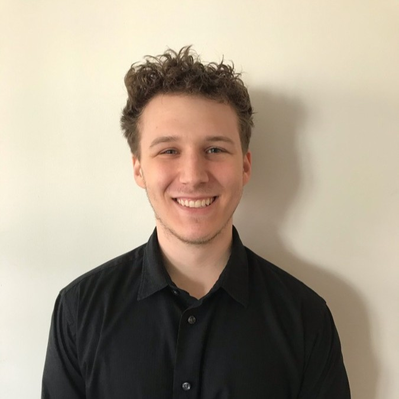

<link rel="stylesheet" type="text/css" media="all" href="./style.css"/>

# Full Stack Engineer at Talent Path

## About

### Summary
* Fullstack engineer with a passion for music and gymnastics.

### Contact Information
* **Email**: - <a href="mailto:jlavendt@talentpath.com">`jlavendt@talentpath.com`</a>
* **Phone**: (571) 748-8555

### Education
* George Mason University (2016-2020)
* Computer Science (BS)

## Work Experience

### Full Stack Engineer at Talent Path (2020-Present)

#### Uniteed States Government Diversity Project

* Visual representation of the demographics of the elected representatives over the past 50 years.
* Postgres database, Java Springboot backend, Typescript and Angular frontend.
* Launched remotely using Heroku.

#### Amazon Item Page Replication

* Full stack replication of an Amazon item page.
* Utilizes github workflow
* Postgres database, Java Springboot backend, Javascript and React frontend.

#### Homemade Checkers

* Full stack replication of the popular game of checkers using no pre-existing checkers libraries.

